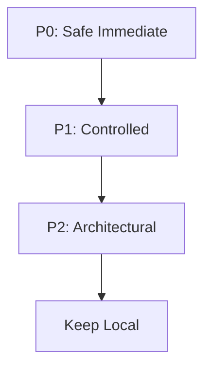

# SHAKTI SDK Migration Audit

This document presents a read-only audit of the SHAKTI Command Center and maps existing application components against the capabilities exported by the vendored SDK.

---

## 1. Executive Summary

This audit assesses the technical readiness, feasibility, and risks associated with migrating SHAKTI's layout, context providers, and UI primitives to the vendored SDK (`@bhiv/*`). 

**The primary verdict is that SHAKTI can safely begin adopting the SDK in an incremental, multi-phase sequence.** Generic presentational components (Skeletons, Error Boundaries, utility classes) are ready for immediate migration (P0). Higher-level layout primitives (Metric Cards, Row Indicators) are candidates for controlled replacement (P1). Core architectural blocks (Providers, Layout Engines, charts) contain deep SHAKTI business logic or require customized data flows and must be deferred (P2 / Keep Local).

---

## 2. Existing SHAKTI Architecture

The SHAKTI Command Center application is structured into presentational primitives, domain-specific layouts, and a global configuration context provider:
* **Context Provider**: Located at [DashboardProvider.tsx](file:///c:/Pratik_Bhuwad/shakti-command-center/src/components/dashboard/DashboardProvider.tsx). It merges defaults with local overrides and exposes the dashboard configuration.
* **Layout Manager**: Located at [Dashboard.tsx](file:///c:/Pratik_Bhuwad/shakti-command-center/src/pages/Dashboard.tsx). Renders a static 12-column grid and wraps each zone inside a `Suspense` fallback, `ErrorBoundary`, and custom column spans.
* **Dashboard Primitives**: Located under `src/components/dashboard/primitives/`. Includes metric widgets (`ExecutiveMetricCard`), timelines (`TimelineCard`), alerts (`AlertCard`), and status/health items (`HealthIndicator`, `StatusCard`).
* **UI Primitives**: Located under `src/components/ui/`. Includes generic components like `Skeleton`.
* **Business Logic**: Encapsulated within 19 layout files (e.g. `ExecutiveLayout.tsx`) that handle query hooks (`useExecutiveDashboard`, `useSetuProjects`) and format data before passing it to primitives.

---

## 3. SDK Capability Inventory

The actual exported APIs from the vendored SDK include:

### `@bhiv/utils`
* **API Surface**: `cn`, `mergeClassNames`, `logger`, `reportPerformanceMetric`, `onRenderCallback`, `useResponsive`
* **Purpose**: Core formatting, telemetry logging, performance monitoring, and breakpoint detection utilities.

### `@bhiv/ui`
* **API Surface**: `Badge`, `Button`, `Card`, `Separator`, `Skeleton`, `Tooltip`, `ErrorBoundary`, `Table`, `Dialog`, `Sidebar`, `NavBar`, `StatusDot`, `StatusBadge`, `ProgressBar`, `StatusIndicatorRow`, `ProgressStatusRow`
* **Purpose**: Presentational components and semantic rows designed for dashboard grids.

### `@bhiv/dashboard-sdk`
* **API Surface**:
  * **Providers**: `DashboardProvider`, `DashboardConfigProvider`, `ThemeProvider`, `FilterProvider`, `SDKProvider`
  * **Hooks**: `useDashboard`, `useWidget`, `useDashboardConfig`, `useTheme`, `useFilters`, `useDashboardSDK`, `useNavigation`
  * **Components**: `WidgetContainer`, `FilterBar`, `LayoutEngine`, `ZoneLayoutEngine`, `BaseCard`, `MetricCardFramework`, `BaseTableFramework`, `GraphFramework`, `TimelineFramework`
  * **Templates**: `ExecutiveTemplate`, `OperationsTemplate`
  * **Registries**: `WidgetRegistry`, `TemplateRegistry`

### `@bhiv/dashboard-layout`
* **API Surface**: `GridLayoutEngine`, `LayoutZone`, `DashboardGrid`, `LayoutEditToolbar`, `useLayoutEngine`, `useDragToReorder`, `useResizableSpan`, `localStoragePersistence`
* **Purpose**: Grid-rendering shell supporting drag-to-reorder, drag-to-resize, and client-side storage adapters.

---

## 4. Component Mapping

| SHAKTI Component | SHAKTI File | SDK Equivalent | SDK Package | Match | Risk | Recommendation |
|---|---|---|---|---|---|---|
| `Skeleton` | `src/components/ui/skeleton.tsx` | `Skeleton` | `@bhiv/ui` | **EXACT** | **LOW** | Migrate immediately. |
| `ErrorBoundary` | `src/components/ErrorBoundary.tsx` | `ErrorBoundary` | `@bhiv/ui` | **HIGH** | **LOW** | Migrate immediately. |
| `cn` | `src/lib/utils.ts` | `cn` | `@bhiv/utils` | **EXACT** | **LOW** | Migrate (re-export from SDK). |
| `ExecutiveMetricCard` | `src/components/dashboard/primitives/ExecutiveMetricCard.tsx` | `MetricCardFramework` | `@bhiv/dashboard-sdk` | **HIGH** | **LOW** | Migrate. |
| `HealthIndicator` | `src/components/dashboard/primitives/HealthIndicator.tsx` | `StatusIndicatorRow` | `@bhiv/ui` | **HIGH** | **LOW** | Migrate. |
| `StatusCard` | `src/components/dashboard/primitives/StatusCard.tsx` | `ProgressStatusRow` | `@bhiv/ui` | **HIGH** | **LOW** | Migrate. |
| `DashboardCard` | `src/components/dashboard/DashboardCard.tsx` | `WidgetContainer` | `@bhiv/dashboard-sdk` | **HIGH** | **MEDIUM** | Migrate after verifying metadata. |
| `TimelineCard` | `src/components/dashboard/primitives/TimelineCard.tsx` | `TimelineFramework` | `@bhiv/dashboard-sdk` | **HIGH** | **MEDIUM** | Refactor/Migrate with custom wrappers. |
| `AlertCard` | `src/components/dashboard/primitives/AlertCard.tsx` | None | N/A | **PARTIAL** | **MEDIUM** | **Keep Local** (holds custom visual status mapping). |
| `TelemetryCard` | `src/components/dashboard/primitives/TelemetryCard.tsx` | `GraphFramework` | `@bhiv/dashboard-sdk` | **PARTIAL** | **HIGH** | **Keep Local** (SDK lacks multi-series/legends support). |
| `DashboardProvider` | `src/components/dashboard/DashboardProvider.tsx` | `DashboardProvider` | `@bhiv/dashboard-sdk` | **HIGH** | **HIGH** | Defer (requires careful config schema align). |
| `DashboardGrid` (grid) | `src/pages/Dashboard.tsx` | `DashboardGrid` | `@bhiv/dashboard-layout` | **HIGH** | **HIGH** | Defer (requires wiring layout engine config). |

---

## 5. Provider / Architecture Analysis

* **SHAKTI Provider**: Manages the local `DashboardConfigContext` which holds branding config and zone visibility.
* **SDK Providers**: Offers a modular hierarchy (`SDKProvider` + `ThemeProvider` + `FilterProvider` + `DashboardConfigProvider`).
* **Coexistence**: Yes. Since SHAKTI uses local hooks, they can run alongside each other during migration.
* **Migration Plan**: Defer replacement of SHAKTI's global provider. Instead, map SHAKTI's config schema to the SDK's `DashboardConfig` interface. Once all layouts are prepared, wrap the app root in the SDK's `DashboardProvider`.

---

## 6. Layout Analysis

SHAKTI's 19 sub-layouts (e.g. `RuntimeHealthLayout.tsx`) contain data loading logic via `@tanstack/react-query` and mapping logic. The SDK's layout package (`@bhiv/dashboard-layout`) operates at a higher abstraction level (reordering, resizing, and persisting cards).
* **Realism of Migration**: Realistic. Each sub-layout component should remain intact as a "Zone Component". We should replace SHAKTI's static 12-column grid in [Dashboard.tsx](file:///c:/Pratik_Bhuwad/shakti-command-center/src/pages/Dashboard.tsx) with the SDK's `DashboardGrid` and drive it via `useLayoutEngine()`.
* **Execution**: Do not replace layouts with template stubs. Preserve all React Query hooks.

---

## 7. UI Component Analysis

The presentational primitives mapped in Section 4 are functionally equivalent. 
* **Skeletons & ErrorBoundaries**: The code is almost identical. The only variance is import statements.
* **Status indicator rows**: `HealthIndicator` maps directly to `StatusIndicatorRow`, and `StatusCard` maps directly to `ProgressStatusRow` with similar props and styling.

---

## 8. Dashboard SDK Analysis

The SDK's components provide wrappers that streamline standard features (like retry buttons, staleness badges, source descriptions, loading states). Adopting them reduces duplicate code inside the 19 layouts.
* **Immediate Adoption**: `WidgetContainer` and `MetricCardFramework`.
* **Deferred Adoption**: Dynamic widget registration (`WidgetRegistry`) and themes (`ThemeProvider`).

---

## 9. Migration Priority

### P0 — Safe Immediate Migration
Generic components with almost no SHAKTI-specific business logic.
1. `Skeleton` (`src/components/ui/skeleton.tsx`)
2. `ErrorBoundary` (`src/components/ErrorBoundary.tsx`)
3. `cn` utility (`src/lib/utils.ts`)

### P1 — Controlled Migration
Ecosystem widgets and card wrappers.
1. `ExecutiveMetricCard` → `@bhiv/dashboard-sdk`'s `MetricCardFramework`
2. `HealthIndicator` → `@bhiv/ui`'s `StatusIndicatorRow`
3. `StatusCard` → `@bhiv/ui`'s `ProgressStatusRow`
4. `DashboardCard` → `@bhiv/dashboard-sdk`'s `WidgetContainer`

### P2 — Architecture Migration
Providers and layout engines.
1. `DashboardGrid` (grid wrapper) → `@bhiv/dashboard-layout`'s `DashboardGrid`
2. `DashboardProvider` → `@bhiv/dashboard-sdk`'s `DashboardProvider`

### KEEP LOCAL
Components with critical SHAKTI business logic or visual specifications not supported by the SDK.
1. `TelemetryCard`: Retains multi-series Recharts configuration and top metrics grid.
2. `AlertCard`: Custom operator acknowledgement and warning styling.
3. `Header`: Custom SHAKTI layout structure.

---

## 10. KEEP LOCAL Components

* **`TelemetryCard`**: SHAKTI's telemetry uses multi-series charts with custom definitions, tooltips, and dynamic headers. The SDK's `GraphFramework` only supports a single `dataKey`. Replacing it would degrade SHAKTI's observability feature.
* **`AlertCard`**: Integrates with operator action states (like `acknowledged`).

---

## 11. High-Risk Components

* **`DashboardProvider` & `DashboardGrid`**: If replaced directly, it changes how config variables are read. Any mismatch in configuration keys (e.g. `zones`) will cause page crashes.

---

## 12. Dependency / File Impact

* **`Skeleton` Migration**: Affects 2 files (`src/pages/Dashboard.tsx`, `src/components/dashboard/DashboardCard.tsx`). Props are exact matches.
* **`ErrorBoundary` Migration**: Affects 1 file (`src/pages/Dashboard.tsx`). Props are exact matches.
* **`DashboardCard` Migration**: Affects all 19 layout files. Props vary slightly (e.g. `timestamp` becomes `metadata.timestamp`), requiring a small adapter.

---

## 13. Recommended Migration Sequence

1. **Phase 2.1**: Redirect `src/components/ui/skeleton.tsx` and `src/components/ErrorBoundary.tsx` to export components from `@bhiv/ui`. This tests the bundler on components immediately.
2. **Phase 2.2**: Update [lib/utils.ts](file:///c:/Pratik_Bhuwad/shakti-command-center/src/lib/utils.ts) to re-export `cn` from `@bhiv/utils`.
3. **Phase 2.3**: Replace `ExecutiveMetricCard` references with `@bhiv/dashboard-sdk`'s `MetricCardFramework`.
4. **Phase 2.4**: Replace `HealthIndicator` and `StatusCard` references with `@bhiv/ui`'s `StatusIndicatorRow` and `ProgressStatusRow`.
5. **Phase 2.5**: Replace `DashboardCard` references in layouts with `@bhiv/dashboard-sdk`'s `WidgetContainer`.

---

## 14. Risks

* **Vite HMR Lag**: Modifying subtree source files might not trigger Hot Module Replacement (HMR) if Vite treats them as static. (Mitigation: use path aliases in Vite config, forcing them to be treated as active modules).

---

## 15. Explicit Non-Goals

* **Do not replace `TelemetryCard`**: Multi-series charts must remain local.
* **Do not modify subtree files**: All packages under `vendor/sdk/` must remain read-only.
* **No global provider changes**: Keep the local `DashboardProvider` in place during Phases 2.1 to 2.4.

---

## 16. Final Recommendation Table

| Priority | Component | Current SHAKTI Location | SDK Replacement | Risk | Action |
|---|---|---|---|---|---|
| **P0** | `Skeleton` | `src/components/ui/skeleton.tsx` | `@bhiv/ui`'s `Skeleton` | Low | Replace import / Redirect local |
| **P0** | `ErrorBoundary` | `src/components/ErrorBoundary.tsx` | `@bhiv/ui`'s `ErrorBoundary` | Low | Replace import / Redirect local |
| **P0** | `cn` | `src/lib/utils.ts` | `@bhiv/utils`'s `cn` | Low | Re-export from SDK |
| **P1** | `ExecutiveMetricCard` | `src/components/dashboard/primitives/ExecutiveMetricCard.tsx` | `@bhiv/dashboard-sdk`'s `MetricCardFramework` | Low | Replace usage in layouts |
| **P1** | `HealthIndicator` | `src/components/dashboard/primitives/HealthIndicator.tsx` | `@bhiv/ui`'s `StatusIndicatorRow` | Low | Replace usage in layouts |
| **P1** | `StatusCard` | `src/components/dashboard/primitives/StatusCard.tsx` | `@bhiv/ui`'s `ProgressStatusRow` | Low | Replace usage in layouts |
| **P1** | `DashboardCard` | `src/components/dashboard/DashboardCard.tsx` | `@bhiv/dashboard-sdk`'s `WidgetContainer` | Medium | Replace usage in layouts |
| **P2** | `DashboardGrid` | `src/pages/Dashboard.tsx` | `@bhiv/dashboard-layout`'s `DashboardGrid` | High | Defer to Phase 3 |
| **P2** | `DashboardProvider` | `src/components/dashboard/DashboardProvider.tsx` | `@bhiv/dashboard-sdk`'s `DashboardProvider` | High | Defer to Phase 3 |
| **Keep Local** | `TelemetryCard` | `src/components/dashboard/primitives/TelemetryCard.tsx` | None | Medium | Retain local |
| **Keep Local** | `AlertCard` | `src/components/dashboard/primitives/AlertCard.tsx` | None | Medium | Retain local |

---

## 17. Phase 2.1 — P0 Migration Result

### Component Migration Details
* **Skeleton** (**PASS**):
  * **File**: `src/components/ui/skeleton.tsx`
  * **Approach**: Thin compatibility re-export of `Skeleton` from `@bhiv/ui`. Keeps all existing imports and API usage intact.
* **ErrorBoundary** (**PASS**):
  * **File**: `src/components/ErrorBoundary.tsx`
  * **Approach**: Thin compatibility re-export of `ErrorBoundary` from `@bhiv/ui`. Keeps all existing imports and API usage intact.
* **cn** (**PASS**):
  * **File**: `src/lib/utils.ts`
  * **Approach**: Re-export of `cn` from `@bhiv/utils` to guarantee full compatibility.

### Verification Results
* **TypeScript** (**PASS**): `npx tsc --noEmit -p tsconfig.app.json` completed with 0 errors.
* **Tests** (**PASS**): `npm run test` completed successfully. All 27 tests pass. Resolved double-React context resolution by backing up the local development `node_modules` under `vendor/sdk/node_modules_dev_backup` and configuring `dedupe` + `inline` rules in `vitest.config.ts`.
* **Build** (**PASS**): `npm run build` completed successfully, producing production output.
* **Lint** (**WARNING**): ESLint ran successfully but returned 114 pre-existing warnings and errors inside SHAKTI. Subtree code is now correctly ignored by ESLint.

---

