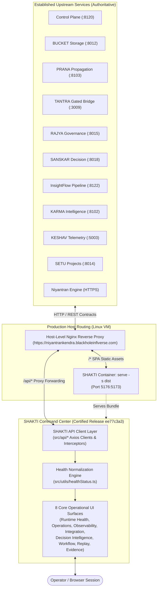

# SHAKTI Architecture & Runtime Position

## 1. Purpose

The **SHAKTI Command Center** is the unified operational command center, observation deck, and runtime integration presentation layer within the Blackhole Infiverse (BHIV) and TANTRA ecosystem.

SHAKTI aggregates runtime telemetry, system health, cryptographically verifiable evidence, project milestones, and workflow intelligence across distributed microservices. It presents an authoritative, real-time command surface to system operators without absorbing, altering, or duplicating the domain business logic of upstream services.

---

## 2. Current Runtime Position

In the current production deployment, SHAKTI resides downstream of the upstream microservice cluster. It connects to established REST contracts through a host-level reverse proxy and serves compiled Single Page Application (SPA) assets to operators.



---

## 3. SHAKTI Responsibilities

SHAKTI's operational scope is strictly bounded to the following verified responsibilities:

1. **Operational Command Center UI**: Providing a responsive, 12-column dashboard layout presenting 8 primary operational surfaces.
2. **Runtime API Integration**: Consuming upstream REST endpoints with standardized request timeouts, error catching, and content negotiation.
3. **Trace Header Propagation**: Capturing distributed tracing headers (`x-trace-id`, `traceparent`, `x-execution-id`) across network boundaries and binding them to telemetry views.
4. **Service Health Aggregation & Normalization**: Translating inconsistent raw status strings from 10 distinct microservices into the canonical three-state model (`operational`, `degraded`, `offline`).
5. **Contract Verification & Trajectory Gating**: Guarding decision intelligence queries (`enabled: !!trajectoryId`) and enforcing canonical payload schemas (e.g. KARMA `POST` contract).
6. **Isolated Error Boundaries**: Containing component-level failures using React ErrorBoundaries so unreleased upstream endpoints do not cause full-screen crashes.
7. **Production Container Packaging**: Packaging optimized, code-split client bundles into lightweight Docker containers (`node:20-alpine`) for VM deployment.
8. **Live Production Certification**: Validating end-to-end operational viability against deployed infrastructure using automated Playwright suites.

---

## 4. Explicit Non-Responsibilities

To maintain clean architectural boundaries and adhere to the constitutional governance model, SHAKTI explicitly does **NOT** own, duplicate, or implement:

* **SANSKAR Domain Logic**: Ranking algorithms, scoring models, and backend route registrations (`/ranking`, `/trace/*`) belong to the SANSKAR team.
* **InsightFlow Pipeline Execution**: Write-synchronization engines, stage queue management, and metrics computation belong to the InsightFlow team.
* **Niyantran Identity & RBAC**: Operator user credential issuance, biometric validation, attendance calculations, and JWT signing belong to the Niyantran service.
* **TANTRA Gated Bridge**: Cryptographic bridge validation, Sarathi security exchanges, and low-level cross-chain transaction signing belong to TANTRA.
* **BUCKET Storage Architecture**: Append-only blockchain storage clustering, data compression, cryptographic hashing, and DB persistence belong to BUCKET.
* **PRANA Propagation Engine**: Distributed event forwarders and message broker topology belong to PRANA.
* **Low-Level Simulation Engines**: Event replay ledgers and simulation execution engines (Pravah) are consumed via telemetry endpoints, not executed inside SHAKTI.

---

## 5. Data Flow

Data traversal follows a strictly unidirectional request-response model:

```
[Operator Browser Action]
        │
        ▼
[React Component / Query Hook]
        │
        ▼
[SHAKTI API Client Module] (src/api/*)
        │
        ▼
[Host Reverse Proxy] (/api/*)
        │
        ▼
[Upstream Service REST Endpoint]
        │
        ▼
[Upstream Engine Execution / State Lookup]
        │
        ▼
[JSON Payload + Tracing Headers]
        │
        ▼
[SHAKTI Response Interceptor] (Header extraction, error normalization)
        │
        ▼
[Status Normalization / Data Transformation] (src/utils/healthStatus.ts)
        │
        ▼
[React Query Cache / UI Render]
```

At no point does SHAKTI maintain independent persistence for upstream service data; all operational data is fetched on-demand or polled via React Query.

---

## 6. Authentication & Trust Boundaries

SHAKTI interfaces with public and protected backend resources through verified trust boundaries:

1. **Public Command-Center View**:
   * Core system status, BUCKET storage stats, PRANA event logs, TANTRA telemetry, KARMA hashes, SETU projects, and public Niyantran metrics (`/api/dashboard/stats`, `/api/dashboard/leaderboard`) require zero client authentication.
   * Operators can monitor ecosystem health without presenting operator credentials.

2. **Protected Operational Routes (Niyantran)**:
   * Endpoints such as `/api/aims`, `/api/tasks`, `/api/dashboard/merge-analysis`, and `/api/dashboard/attendance-summary` require authenticated operator privileges.
   * In commit `b0b66751`, static build-time tokens were removed. Authentication tokens are loaded dynamically at runtime from `localStorage.getItem("WorkflowToken")` and transmitted as `x-auth-token`.
   * Requests made without an operator token return `HTTP 401 Unauthorized`. SHAKTI handles 401s gracefully by rendering empty states, ensuring public dashboard functionality is never blocked.

3. **Gateway Keys**:
   * Where upstream gateways enforce API authentication, keys are provided via build-time or deployment-time environment variables (`VITE_NIYANTRAN_EXECUTION_KEY`, `VITE_TANTRA_BRIDGE_SIGNATURE`).
   * Secret values are injected during CI/CD build stages and are never stored in the repository.

---

## 7. Constitutional & Architectural Boundaries

In accordance with T-GOV-002 requirements:

1. **No Constitutional Architecture Redesign**: SHAKTI does not redefine the service boundaries, governance policies, or communication topology of the BHIV ecosystem.
2. **No Ownership Absorption**: Upstream services retain full authoritative ownership of their respective domain models and data stores.
3. **No Duplicated Business Logic**: SHAKTI does not re-calculate metrics, re-score entities, or generate synthetic fallbacks for missing backend features.
4. **Preservation of Established Contracts**: SHAKTI conforms to authoritative live contracts (such as the KARMA `POST` contract and SETU `/api/setu/` paths) rather than forcing backend rewrites to match legacy frontend expectations.

---

## 8. Runtime Health Model

Microservices emit health payloads with differing status representations. To prevent misleading operational statuses, SHAKTI employs a pure frontend normalization utility (`src/utils/healthStatus.ts`):

```typescript
export type NormalizedComponentStatus = "operational" | "degraded" | "offline";
```

### Normalization Logic:
* **`operational`**: strictly reserved for services responding with `healthy`, `operational`, `ok`, or `online` under active network success.
* **`degraded`**: assigned when a service responds with `degraded` or `warning`, during active queries (`isLoading`), or when status values are unknown. A degraded service is never masked as fully operational.
* **`offline`**: assigned when transport fails (`isError`) or the service reports `offline`, `unhealthy`, `failed`, `error`, `crash_looping`, or `down`.

This behavior is tested and verified by 27 unit tests in `src/test/health-mapping.test.tsx`.

---

## 9. Production Certification Position

SHAKTI release `ee77c3a3d12f46ec8013a2e5230a6b7d53824f90` is certified for production deployment on `https://niyantrankendra.blackholeinfiverse.com`.

### Verified Production Evidence:
* **Production E2E Tests**: `4/4 passed` (0 failures, 0 skips, 44.4s duration) via Playwright against the live production VM.
* **Unit & Integration Tests**: `61/61 passed` across 7 test suites in 9.41s via Vitest.
* **TypeScript Compilation**: `npx tsc -b` completed with 0 errors and 0 warnings (exit code 0).
* **Production Build**: Clean client bundle generation in 2.13s (52 assets, 19 layout chunks).
* **Core Surfaces**: All 8 operational surfaces mounted cleanly with zero unhandled page errors or ErrorBoundary catches.
* **Live Network Observation**: Zero HTTP 5xx server errors observed across 89 live production requests.
* **Final Verdict**: **READY WITH DOCUMENTED DEGRADATIONS** (referenced in `docs/SHAKTI-Production-Certification-Report.md`).

---

## 10. Known Risks & Future Integration Roadmap

To maintain clarity for development and operations teams, current gaps and future responsibilities are categorized as follows:

### Current Documented Limitations (Acceptable for Certified Core Operation)
1. **SANSKAR Secondary Routes (`/ranking`, `/trace/*`)**: Return HTTP 404. Core decision intelligence derives from Control Plane operations; health check returns 200 OK.
2. **InsightFlow Secondary Routes (`/stage-metrics`, `/bucket/status`)**: Return HTTP 404. Telemetry charting is populated by live PRANA logs, BUCKET metrics, and TANTRA telemetry; health check returns 200 OK.
3. **Niyantran Protected Endpoints**: Return HTTP 401 without an authenticated operator session. Public dashboard statistics (`/dashboard/stats`, `/dashboard/leaderboard`) return 200 OK.

### External Service-Owned Future Work
* **SANSKAR Team**: Implement and register the `/ranking` and `/trace/{trace_id}` REST endpoints in the upstream SANSKAR service (`163.128.209.18:8018`).
* **InsightFlow Team**: Expose stage metric aggregation and bucket sync state on `/stage-metrics` and `/bucket/status` in the upstream InsightFlow service (`163.128.209.18:8122`).
* **Niyantran Team**: Publish operator session guidance and token lifecycle documentation for protected dashboard views.

### SHAKTI-Owned Future Work (Post-Milestone)
* **BHEX Registries Integration**: Replace placeholder functions in `src/api/endpoints.ts` (`fetchRepositoryRegistry`, `fetchBuildRegistry`, `fetchMigrationQueue`, `fetchReviewQueue`, `fetchCapabilityRegistry`) once canonical BHEX backend services are deployed.
* **Authenticated Operator Flows**: Expand E2E testing to cover authenticated operator sessions once Niyantran operator credential fixtures are provided.
