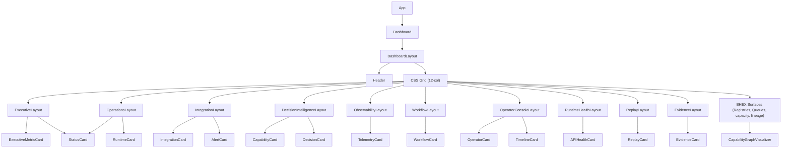

# Dashboard Architecture

**Project:** SHAKTI Runtime Integration and Operational Command Center

---

## 1. Purpose
The SHAKTI Operational Command Center is a production-grade frontend application that provides a centralized, real-time operational interface. It consolidates runtime status, live alerts, forecasting insights, incident tracking, system health, replay status, and operational evidence into a single command-grade interface.

The dashboard is designed to replace static reporting with a responsive, information-dense operational command center that enables grid operators, regional controllers, and executive users to achieve situational awareness within seconds of loading.

---

## 2. Architecture Overview
The frontend is a single-page application (SPA) built on React 19 with Vite 8 as the build toolchain. It follows a strict separation between presentation, data-fetching, and type contracts.

```
┌─────────────────────────────────────────────────────────────┐
│                     Browser (SPA)                           │
│                                                             │
│  ┌──────────────┐   ┌──────────────┐   ┌────────────────┐  │
│  │  React UI    │   │ TanStack     │   │  Axios HTTP    │  │
│  │  Components  │◄──│  Query Cache │◄──│  Clients       │  │
│  │  (19 layouts)│   │              │   │  (12 clients)  │  │
│  └──────────────┘   └──────────────┘   └────────────────┘  │
│                                                │            │
└────────────────────────────────────────────────┼────────────┘
                                                 │
                                    ┌────────────▼────────────┐
                                    │   REST API Backends     │
                                    │   (Configured in .env)  │
                                    └─────────────────────────┘
```

---

## 3. Dashboard Philosophy
The dashboard is designed as an **operational command center**, not a reporting tool. Three principles govern every design decision:

- **Operational First**: Critical alerts, grid status, and executive metrics occupy the highest visual priority. Analytical data follows.
- **Low Scroll**: Critical Level 1 information fits within the initial viewport on standard displays.
- **Runtime Driven**: The frontend contains zero business logic. It consumes and visualizes API outputs only.

---

## 4. Component Hierarchy
The page grid is composed dynamically in `src/pages/Dashboard.tsx` based on the config loaded via `DashboardProvider`:


