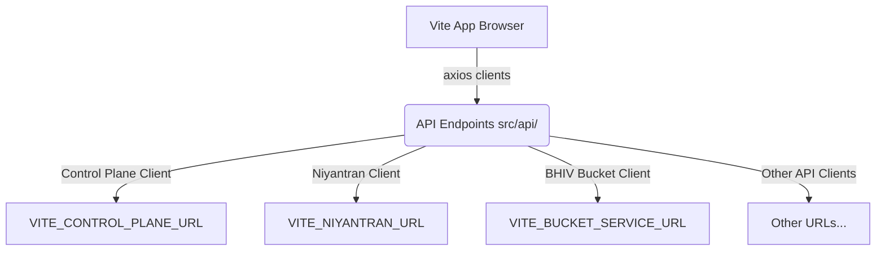

# Production Review Packet

This document acts as the technical review guide for the production certification of the SHAKTI Command Center.

---

## 1. System Architecture & Entry Points

*   **Entry Point**: The application bootstrap entry point is [src/main.tsx](file:///c:/Pratik_Bhuwad/shakti-command-center/src/main.tsx), which registers the standard React router and context providers.
*   **Context Provider**: [DashboardProvider.tsx](file:///c:/Pratik_Bhuwad/shakti-command-center/src/components/dashboard/DashboardProvider.tsx) acts as the configuration context for the dashboard grid layout, managing layouts, presets, and customization locks.
*   **State Management**: React Query (via `@tanstack/react-query`) is used for managing all server-side states, fetching data, handling cache, and tracking loading/error metrics.

---

## 2. Core Execution & Data Flows

### A. API Flow


### B. Employee Execution & Workload Flow
*   The [EmployeeExecutionLayout.tsx](file:///c:/Pratik_Bhuwad/shakti-command-center/src/components/dashboard/layouts/EmployeeExecutionLayout.tsx) renders data fetched via `useEmployeeExecution()`.
*   Under the hood, `fetchEmployeeExecution()` queries `/api/dashboard/attendance-summary` from the Niyantran backend.
*   If Niyantran is unreachable or returns a server error (e.g. 504 Gateway Timeout), the hook catches the error and returns a clean fallback list containing `engineers: []` and status indicators marked as `STALE`.

### C. Replay & Evidence Flow
*   **Replay**: Managed inside [ReplayLayout.tsx](file:///c:/Pratik_Bhuwad/shakti-command-center/src/components/dashboard/layouts/ReplayLayout.tsx) using the `useBucketChainState` and `useAuditRecent` query hooks.
*   **Evidence**: Managed inside [EvidenceLayout.tsx](file:///c:/Pratik_Bhuwad/shakti-command-center/src/components/dashboard/layouts/EvidenceLayout.tsx) which fetches and visualizes block details, merkle paths, and storage compressions.

---

## 3. Failure & Retry Handling

*   **Network Timeouts**: API clients are configured with timeouts ranging from 10s to 30s. The 30s limits are specifically chosen for Rajya, Sanskar, and Tantra to absorb cold starts of Render services.
*   **Network Loss**: Browser network status is checked globally. When disconnected, an offline notification banner is shown, and the application serves existing state from the React Query cache.
*   **API Outage**: Endpoints wrap their network calls in `try...catch` blocks to prevent Axios rejects from crashing layout components.

---

## 4. Integration Matrix

The detailed list of endpoints and hook bindings is cataloged in the [production_runtime_audit.md](file:///c:/Pratik_Bhuwad/shakti-command-center/audit/production_runtime_audit.md) file.

---

## 5. Deployment & Verification Steps

### Local Verification:
1.  Verify compilation:
    ```bash
    npm run build
    ```
2.  Run the tests:
    ```bash
    npm run test
    ```

### Production Deployment Steps (CI/CD Pipeline):
1.  Code is pushed to the `main` branch.
2.  GitHub Actions runner builds the Docker image and tags it with the short commit SHA.
3.  The runner logs in to Docker Hub and pushes the image.
4.  The runner connects to the remote VM via SSH.
5.  Extracts compose templates, injects the short SHA, and spins up containers using `docker compose up -d`.
6.  Runs health check script verifying container is healthy and port 5176 responds.

---

## 6. VM & Production Proofs (Missing Evidence)

Refer to [MISSING_EVIDENCE.md](file:///c:/Pratik_Bhuwad/shakti-command-center/evidence_packet/MISSING_EVIDENCE.md) for details on deployment logs, active container metrics, and testing approvals that must be captured from the VM environment.
